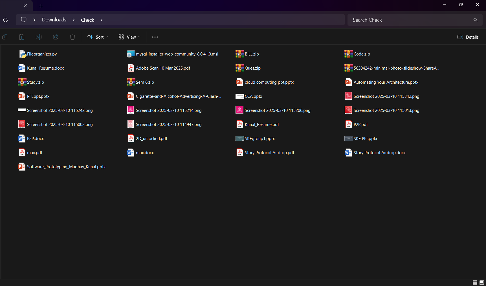
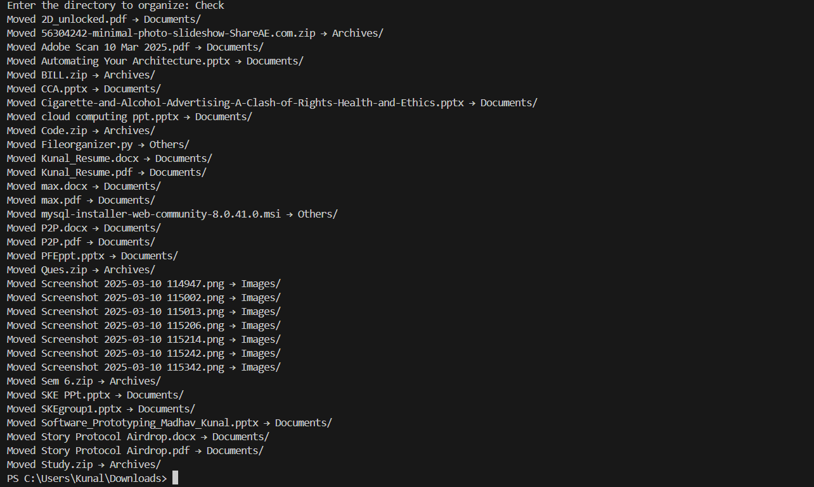
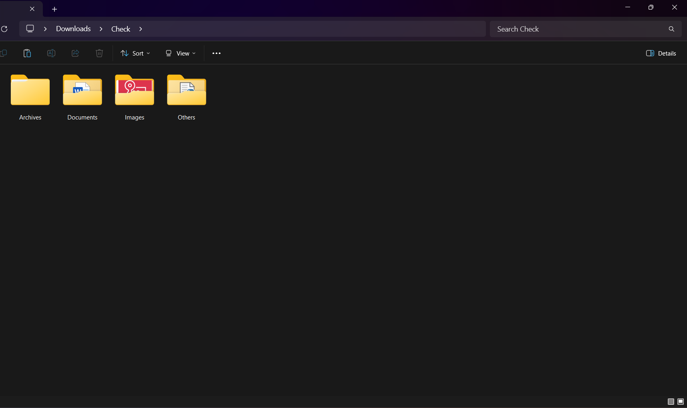

# File Organizer

## Overview
File Organizer is a Python script that automatically sorts and moves files into categorized folders based on their extensions. This helps keep directories organized and clutter-free.

## Features
- Categorizes files into predefined groups: Images, Documents, Videos, Audio, Archives, and Others.
- Automatically creates required folders.
- Moves files into the appropriate folders based on their extensions.
- Simple command-line interface.

## Installation
1. Clone this repository:
   ```bash
   git clone https://github.com/abnes30/FileOrganizer.git
   cd FileOrganizer
   ```
2. Ensure you have Python installed (Python 3 recommended).

## Usage
Run the script and provide the target directory when prompted:
```bash
python Fileorganizer.py
```
Then, enter the directory path you want to organize.

## Example
### Before Running the Script:


### Running the Script:


### After Running the Script:



## File Categories
| Category   | Extensions |
|------------|--------------------------------|
| Images    | .jpg, .jpeg, .png, .gif, .bmp |
| Documents | .pdf, .docx, .txt, .pptx, .xlsx |
| Videos    | .mp4, .mkv, .avi, .mov |
| Audio     | .mp3, .wav, .aac |
| Archives  | .zip, .rar, .tar, .gz |
| Others    | Any file that doesn’t match the above |

## Contributing
Feel free to fork this project and submit pull requests with improvements or new features.

## License
This project is licensed under the MIT License.
